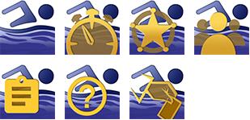

# SCM_LeaderBoard-R
Track your club's swimmers and house scores. Part of the SwimClubMeet eco system of applications to run your swimming meets.

## PLEASE NOTE: 23/10/2022 - BETA VERSION AVAILABLE FOR REVIEW

---
SCM_LeaderBoard is a 32bit application written in pascal. It's part of an eco system of applications that make up the SwimClubMeet project. SCM lets amateur swimming clubs manage members and run their club night's. (A meet manager.)

To learn more about SCM view the [github pages](https://artanemus.github.io/index.html).

If you are interested in following a developer's blog and track my progress then you can find me at [ko-fi](https://ko-fi.com/artanemus).

---

### USING LeaderBoard

After install, by default, an icon is placed on the desktop. If you elected to disable this, type **lead** in the windows search bar to discover it. Else navigate to the **Artanemus** folder on the start bar. (All SCM applications and utilities are located in this folder.)

### ON START-UP

The application will ask you to login to the database. Currently there is no help file for this application. So I offer you these notes.

Got to the hamburger menu and select your preferences. Next, select one of the speed-buttons located top left. A leader-board will be produced. (Member, house, event, etc). 

The leader-board can be printed or exported out as PDF. 

> Use Windows **Apps and Features** to remove the application.

---

